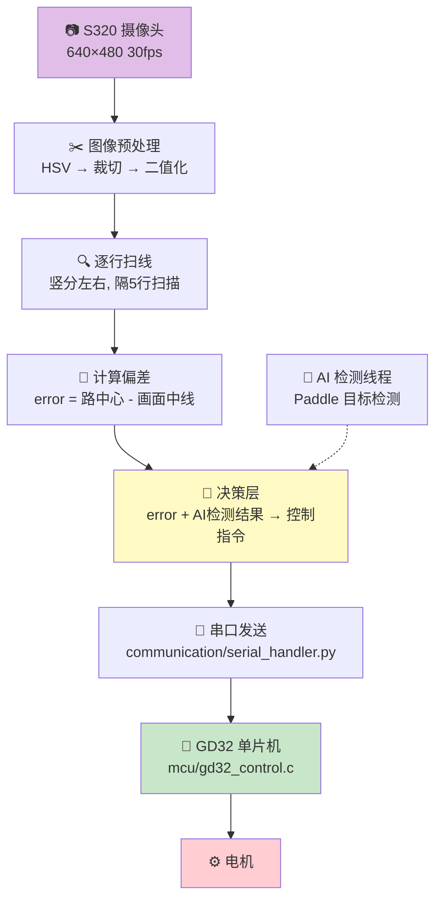

# 🚗 无人驾驶小车 — 开发路线图

> **比赛平台:** EdgeBoard + GD32F103C8T6  
> **框架:** PaddlePaddle (目标检测) + OpenCV (传统巡线)  
> **对标项目:** 16届全国大学生智能汽车竞赛 (百度赛道) 开源方案

---

## 📁 项目地图

```
Project_DriverlessCar/
│
├── 📂 tracking/                    ┃ 巡线模块 ┃ 车的眼睛
│   ├── line_tracker.py             ┃   主程序，六层管线全在这里
│   └── simulate_track.py           ┃   虚拟赛道，算法验证
│
├── 📂 communication/               ┃ 通讯模块 ┃ 上位机 ↔ 单片机
│   └── serial_handler.py           ┃   串口收发封装
│
├── 📂 decision/                    ┃ 决策模块 ┃ 大脑
│   └── decide.py                   ┃   error + AI → 控制指令
│
├── 📂 ai_training/                 ┃ AI 训练 ┃ 眼睛的升级版
│   ├── config.py                   ┃   参数集中营
│   ├── data_loader.py              ┃   喂数据
│   ├── model.py                    ┃   网络结构
│   ├── train.py                    ┃   训练脚本
│   ├── eval.py                     ┃   验证评估
│   ├── predict.py                  ┃   单图测试
│   ├── export_model.py             ┃   模型导出
│   ├── dataset/                    ┃   2035 张图，8 个类别
│   └── output/                     ┃   训练产物
│
├── 📂 mcu/                         ┃ 单片机 ┃ 手脚
│   └── gd32_control.c              ┃   GD32 电机控制
│
└── 📂 docs/                        ┃ 文档 ┃
    ├── README.md                   ┃   项目概览
    ├── ROADMAP.md                  ┃   你在这里
    └── architecture.md             ┃   详细架构
```

---

## 🔗 六层数据流



---

## 🎯 三阶段开发计划

### 🟢 第一梯队 — 让车动起来

> **目标：传统 CV 巡线 → 串口 → 单片机 → 电机转动**  
> **做完后：车能沿直线跑**

| 🔢 | 模块 | 对标开源 | 核心任务 | 状态 | ⏱️ |
|:--:|------|------|------|:--:|:--:|
| **P1** | `tracking/line_tracker.py` | `myfun.py` `camera.py` `main.py` | 修 4 个 bug → 补主循环缺失步骤 | 🔄 | 1h |
| **P2** | `communication/serial_handler.py` | `serial_port.py` | 封装串口：打开→发送→关闭 | ❌ | 0.5h |
| **P3** | `mcu/gd32_control.c` | `cart.py` | 串口中断→解析指令→PWM 差速控制 | ❌ | 2h |

> **🔗 P1 关联文件:** [[tracking/line_tracker.py]] ← 当前还有 4 个 bug 要修  
> **🔗 P2 关联文件:** [[communication/serial_handler.py]] ← 待创建  
> **🔗 P3 关联文件:** [[mcu/gd32_control.c]] ← 待创建

---

### 🟡 第二梯队 — 让车变聪明

> **目标：AI 检测障碍物 → 决策层判断 → 自动停车避障**  
> **做完后：车能跑完整赛道**

| 🔢 | 模块 | 对标开源 | 核心任务 | 状态 | ⏱️ |
|:--:|------|------|------|:--:|:--:|
| **P4** | `decision/decide.py` | `driver.py` | 从 tracker 中抽出 decide()，修复 bug，独立成模块 | 🔄 | 1h |
| **P5** | `ai_training/` 重训 | `train_object_detection.py` | stride 16 重训 → predict.py 验证 → 确认检出率 | 🔄 | 4h |
| **P6** | 多线程接入 | `main.py` 线程架构 | 主循环丢帧给 AI → 读结果 → 传决策 → 锁保护 | 🔄 | 1h |

> **🔗 P4 关联文件:** [[decision/decide.py]] ← 待独立  
> **🔗 P5 关联文件:** [[ai_training/train.py]] ← stride 16 已就绪，跑一次即可  
> **🔗 P6 关联文件:** [[tracking/line_tracker.py]] ← 在 P1 基础上加线程逻辑

---

### 🔵 第三梯队 — 锦上添花

> **目标：比赛冲高分**  
> **做完后：带 CNN 端到端巡线 + 复杂动作序列的完整方案**

| 🔢 | 模块 | 对标开源 | 核心任务 | ⏱️ |
|:--:|------|------|------|:--:|
| **P7** | 数据采集 | `nocontrol_collect_line_data.py` | CV 巡线时自动录 (图片, 角度) 数据对 | 3h |
| **P8** | 训练巡线 CNN | `Train_line_patrol.py` | 用 P7 数据训练端到端巡线，替换传统 CV | 6h |
| **P9** | 二进制协议 | `widgets.py` | 升级为 `0xAA 0xBB + 长度 + 数据 + 校验` | 3h |
| **P10** | 复杂动作 | `main.py` 的 `jiba()` `ruku()` | 入库 / 击靶 / 抓取等开环动作序列 | 4h |

---

## 📋 模块功能明细

### `tracking/line_tracker.py`

| 项目         | 内容                                                                                                                                                                          |
| ---------- | --------------------------------------------------------------------------------------------------------------------------------------------------------------------------- |
| **职责**     | 主程序入口，串起六层管线                                                                                                                                                                |
| **输入**     | 摄像头 (640×480 BGR, 30fps)                                                                                                                                                    |
| **处理**     | HSV → V 通道 → 裁切 (225:480行) → 反二值化 (阈值80) → 逐行扫线 → 计算 error                                                                                                                  |
| **输出**     | 串口发送控制指令 (`"30"` / `"STOP"` / `"SLOW,15"` / `"PAUSE"`)                                                                                                                      |
| **依赖**     | `serial_handler.py` / `decide.py` / `ai_training/` (模型训好后)                                                                                                                  |
| **对标开源**   | `src/main.py` + `myfun.py` + `camera.py`                                                                                                                                    |
| **已知 bug** | ❶ `d["class" == "crosswalk"]` 括号错位 ❷ `return str(error)` 缩进在 for 里 ❸ `AI_lock()` 多了括号 ❹ `time.sleep(0.1)` 缩进错 ❺ 主循环缺 `latest_AI_ima = Ima.copy()` ❻ 主循环缺读 AI 结果 + 决策 + 串口发送 |

### `communication/serial_handler.py`

| 项目 | 内容 |
|------|------|
| **职责** | 串口收发统一封装 |
| **接口** | `open(port, baudrate)` → `send(cmd)` → `close()` |
| **协议** | 当前: 文本 + `\n` 结尾 (`"STOP\n"`)  |

### `decision/decide.py`

| 项目 | 内容 |
|------|------|
| **职责** | error + AI 检测结果 → 控制指令字符串 |
| **优先级** | 行人(框大) > 锥桶(框大) > 斑马线 > 正常巡线 |
| **输入** | `dets` (检测结果列表), `error` (整数) |
| **输出** | `"STOP"` / `"PAUSE"` / `"SLOW,{error}"` / `"{error}"` |

### `mcu/gd32_control.c`

| 项目 | 内容 |
|------|------|
| **职责** | GD32F103C8T6 ARM Cortex-M3 电机控制 |
| **输入** | 串口 (115200 8N1) 接收字符串 |
| **处理** | `readStringUntil('\n')` → `atoi()` 解析 / 字符串匹配 |
| **输出** | 两路 PWM → 左右电机差速 |
| **特殊指令** | `STOP` 停车 / `PAUSE` 暂停 / `SLOW,{error}` 减速 |

---

## 🏷️ 状态图例

| 标记 | 含义 |
|:--:|------|
| ✅ | 完成并验证 |
| 🔄 | 骨架有，待完善 |
| ❌ | 还没开始 |

---

*最后更新: 2026-07-08 | 下一个动作: 训练 AI 模型 / 补 driver.py + cart.py*

---

## 📝 更新日志

---

### 📅 2026-07-08（续）── AI 训练框架升级为 PaddleX

- ✅ **安装 PaddleX 3.7.2** — 飞桨第三代高层 API，支持 Python 3.12
- ✅ **新建 `train_paddlex.py`** — 用 PicoDet-S 替代手写 SSD，内置正负样本平衡
- ✅ **归档旧框架** — 手写六个 py 文件移至 `_legacy/`，保留备查
- ✅ **删除旧 output/** — 上次 stride 16 模型报废，干净重来
- ✅ **更新 README.md** — 文件架构同步最新结构

---

### 📅 2026-07-08（早前）── 决策层重构 & 项目重组

---

#### ✅ 今日完成

| # | 模块 | 具体成果 |
|:--:|------|------|
| P1 | `tracking/line_tracker.py` | 六层管线全部串通：`读帧 → 预处理 → 扫线 → error → 决策 → 串口` |
| — | 决策层 | `Decide()` 重写为双层架构：① 障碍（连续3帧计数器）② 路标（缓存→消失→多数投票） |
| — | 参数集中 | 新建 `tracking/config.py`，19 个硬编码数字全部替换为变量名 |
| — | 项目重组 | 旧散乱文件迁移至 `E:/VScode/Project_DriverlessCar/`，按模块分目录 |
| — | 主循环 | 补齐四步：`丢帧给AI → 读AI结果 → 调Decide() → 串口发送` |
| — | 文档 | ROADMAP.md 三梯队计划 + Mermaid 架构图 + 模块功能明细 |

---

#### ❌ 仍待完成

| # | 模块 | 当前卡在哪 | 下一步 |
|:--:|------|------|------|
| P2 | `communication/serial_handler.py` | 文件夹空，串口逻辑裸写在 tracker 里 | 封装成类：`open / send / close` |
| P3 | `mcu/gd32_control.c` | 一行没写 | 串口中断 + PWM 差速 + CMD 解析 |
| P4 | `decision/decide.py` | 决策函数仍内联在 tracker 中，耦合太紧 | 独立成文件，供未来扩展 |
| P5 | `ai_training/` 模型 | stride 16 修了小目标 bug 但没重训 | `python train.py` → `predict.py` 验证 → 导出 |
| P6 | 多线程 AI 推理 | `AI_Loop()` 有骨架，`detect_objects` 未对接训练好的模型 | 模型训好后改一行代码即可 |

---

#### 📊 对标开源项目 — 差距总览

> 对标目标：`The-national-university-student-intelligent-car-race-main1`（18个模块）  
> 当前匹配：**7/12 ≈ 58%**（已排除手柄和外设）

```
开源项目                          你的状态
─────────────────────────────────────────────────────
myfun.py              ──── ✅    tracking/line_tracker.py 二~四层（传统CV巡线）
camera.py             ──── ✅    主循环内联 cap.read()（简化版）
main.py               ──── ✅    tracking/line_tracker.py 主循环 + 决策
config.py             ──── ✅    tracking/config.py
train_object_det...   ──── ✅    ai_training/ 全套训练框架（未验证）
─────────────────────────────────────────────────────  58% ── 及格线
driver.py + cart.py   ──── ❌    一行 ser.write("文本") 替代差速计算
serial_port.py        ──── ❌    裸调 ser.write，未封装
predictor_wrapper.py  ──── ❌    AI_Loop() 里 detect_objects 没接
─────────────────────────────────────────────────────
nocontrol_collect...  ──── ❌    第三梯队，数据采集脚本
Train_line_patrol.py  ──── ❌    第三梯队，CNN 端到端巡线（当前用传统CV）
widgets.py            ──── ⬜    暂无外设需求
joystick.py           ────  —    不需要
```

```
5 个 ✅ ｜ 3 个 ❌ ｜ 3 个 ⬜（暂不需要 / 第三梯队）
████████████████████░░░░░░░░░░░░ 58%
```

---

#### ⏭️ 下次任务（按优先级）

1. **P5** — `ai_training/` 重训 stride 16 模型 → 验证检出率（跑命令，后台等）
2. **P2 + driver/cart** — 串口封装 + error→差速→二进制包的完整通讯链路
3. **P3** — GD32 单片机 C 代码
